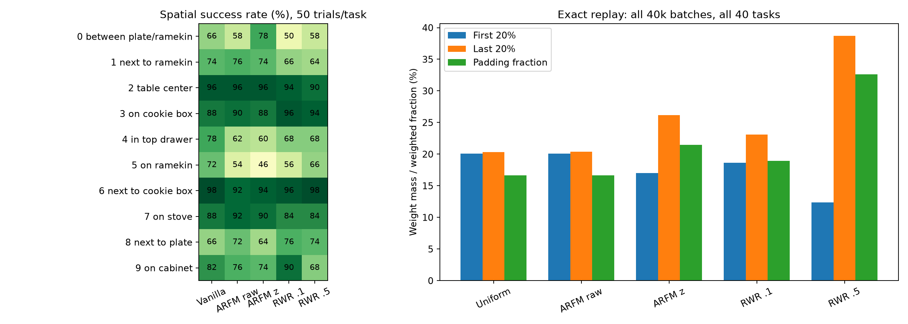

# ARFM / π0 + LIBERO

基于历史 LeRobot π0 的 ARFM 独立复现，使用 GPU 0–3。仓库包含训练、评估、奖励重建、离线权重诊断及实验记录；不包含模型权重、演示数据或虚拟环境。本文是仓库唯一的 Markdown 文档。

## 已完成结果

每种方法训练40k steps；40个任务，每个任务50次固定初始状态评估，共2000次。均为seed42、最后checkpoint，成功率如下：

| 方法 | Replan步数 | Goal | Spatial | Object | Long | 平均 |
|---|---:|---:|---:|---:|---:|---:|
| Vanilla | 50 | 70.4% | 58.8% | 65.6% | 36.4% | 57.8% |
| 原始ARFM | 50 | 68.4% | 57.4% | 64.6% | 39.4% | 57.45% |
| Vanilla | 5 | 81.0% | 80.8% | 91.4% | 68.0% | **80.3%** |
| 原始ARFM | 5 | 84.2% | 76.8% | 91.8% | 72.4% | **81.3%** |

原始ARFM权重几乎均匀，训练平均ESS约16；上述单seed差异不能说明加权机制有效。结构化结果见 `artifacts/replan5_comparison.json`。

## Advantage scaling 实验

新增 `--advantage-normalization task_zscore`：对每个concrete task的全部训练chunk优势计算总体均值和标准差，使用 `(A-mean)/(std+1e-8)`。默认 `none` 保留历史行为，原始数据文件不改写。

训练前先做零参数更新的离线检查：每个checkpoint使用256个真实batch，每批16条，seed2026，保留训练增强和uniform时间采样。已有vanilla 40k模型上的结果：

| 权重方式 | 平均ESS | 平均最大权重 | 平均最小权重 | ESS<4占比 |
|---|---:|---:|---:|---:|
| 原始ARFM | 16.0000 | 0.062703 | 0.062424 | 0% |
| z-score ARFM | 14.2979 | 0.124857 | 0.046905 | 0% |
| RWR α=0.1 | 15.7949 | 0.080826 | 0.056800 | 0% |
| RWR α=0.5 | 11.4966 | 0.220567 | 0.034774 | 12.11% |
| RWR α=1 | 7.2473 | 0.398639 | 0.017324 | 32.42% |

初始π0上z-score ARFM的平均ESS仍为15.984，早期加权很弱。成熟模型上的平均ESS略高于建议的8–14范围，但已非均匀，且没有ESS<4的batch，因此保留solver和λ=0.0005，不强行调到目标ESS。固定α选择0.1和0.5；α=1因权重过于集中不进入训练。

新队列依次运行z-score ARFM、RWR α=0.1、RWR α=0.5，各从原始π0初始化，训练40k并以replan=5评估2000次。保留vanilla 80.3%基线，不改extra-delta、camera、sampler及其他训练设置。scaling三组现已完成：z-score ARFM 79.85%，RWR α=0.1 81.10%，RWR α=0.5 77.90%；逐suite结果见 `artifacts/scaling_comparison.json`。离线逐样本数据、协议和统计保存在 `artifacts/scaling_diagnostic/`。

## Extra delta Vanilla 对照（2026-10-04）

在独立的 `vanilla_extra_delta_uniform_seed42` 实验中，从原始π0重新训练Vanilla 40k步，seed42、global batch16、uniform时间采样，使用GPU0–3；完成后以replan=5评估40×50次。相机、action horizon、采样器、优化器及学习率保持原设置，原始80.3% baseline不变。

采用 [OpenPI legacy LIBERO](https://github.com/Physical-Intelligence/openpi/blob/main/src/openpi/training/config.py) 的extra delta约定：chunk内每个动作的前6维减去chunk起点的原始state前6维，gripper不变。先变换再归一化。推理先反归一化，再加回生成该chunk时的state；执行队列后续动作时不使用新的state，replan时更新锚点。LIBERO原始动作本来就是delta，这里是明确的legacy兼容实验，不代表原数据是绝对动作。

重新计算338575个state、16928750个chunk动作的总体mean/std：覆盖每个chunk起点与全部50个offset，包括末尾repeat-last padding；数值变换与加载器相同，使用float64累计。原始manifest按单帧统计动作，新统计按展开的chunk统计，两者的统计口径区别明确记录在 `artifacts/extra_delta_norm_stats.json`。训练使用独立文件 `data/processed/manifest_extra_delta.json`，checkpoint携带完整统计及transform标记，评估自动读取。

```bash
source scripts/env.sh
.venv/bin/python scripts/compute_delta_stats.py
bash scripts/run_vanilla_delta.sh
```

队列先验证2步四卡训练、checkpoint重载及1次闭环rollout，然后独立初始化正式训练；smoke结果不作为成功率证据。状态位于 `artifacts/vanilla_delta_pipeline_state.txt`，日志为 `logs/train_vanilla_extra_delta.log`，tmux会话为 `vanilla_delta`。完成后生成 `artifacts/vanilla_delta_comparison.json`。25项测试及真实数据动作往返检查通过。

## 安装与数据

Linux、Python3.11；以下安装流程未在另一台机器上重新验证。

```bash
git clone https://github.com/Serein55/OfflineRL.git
cd OfflineRL
bash scripts/fetch_sources.sh
python3.11 -m venv .venv
.venv/bin/pip install --extra-index-url https://download.pytorch.org/whl/cu118 -r requirements-lock.txt
.venv/bin/pip install --no-deps -e vendor/lerobot
source scripts/env.sh
.venv/bin/python scripts/download_assets.py
export PALIGEMMA_TOKENIZER_MODEL=/path/to/paligemma_tokenizer.model
.venv/bin/python scripts/setup_local.py
.venv/bin/python scripts/preprocess.py --workers 24
```

本次tokenizer复用已有官方OpenPI SentencePiece文件，哈希已保存。`fetch_sources.sh` 固定第三方commit并应用兼容补丁；环境版本见 `requirements-lock.txt` 和 `artifacts/environment.lock.txt`，来源见 `artifacts/provenance.json` 及各下载目录的 `download.json`。数据为40 tasks ×50 demos，共2000条轨迹、338575个chunk。

## 训练与评估

```bash
source scripts/env.sh
.venv/bin/python -m pytest tests -q
# 仅前向诊断，不更新模型；需要已有vanilla 40k checkpoint
.venv/bin/torchrun --standalone --nproc_per_node=4 scripts/diagnose_advantage_scaling.py
# 诊断通过后依次训练、评估三组scaling实验；已有后台队列时不重复启动
bash scripts/run_scaling_experiments.sh
```

独立运行单组实验：

```bash
.venv/bin/torchrun --standalone --nproc_per_node=4 scripts/train.py \
  --method arfm --advantage-normalization task_zscore \
  --time-sampler uniform --steps 40000 --output artifacts/arfm_taskz_uniform_seed42
.venv/bin/python scripts/evaluate.py \
  --checkpoint artifacts/arfm_taskz_uniform_seed42/latest.pt \
  --replan-steps 5 --output artifacts/arfm_taskz_uniform_seed42/evaluation.jsonl
```

`--method rwr --fixed-alpha 0.5` 运行固定α对照，`--method vanilla` 运行基线；`--time-sampler beta` 使用历史Beta采样。旧 `scripts/run_pipeline.sh` 对应原始实验及replan=50，新实验使用 `scripts/run_scaling_experiments.sh`。

每步记录 `metrics.jsonl`；每1000步保存模型、各卡优化器分片及RNG，原子更新 `latest.pt`，保留最近两个checkpoint。恢复添加 `--resume <latest.pt>`，要求原4卡规模和相同方法/scaling配置，`--steps` 是累计目标步数。

查看当前scaling队列：

```bash
cat artifacts/scaling_pipeline_state.txt
tail -n 5 logs/train_arfm_taskz.log
tmux -L arfm list-sessions
```

后台会话名为 `scaling`，日志位于 `logs/`；GitHub上的结果是推送时快照，不是实时状态。`scripts/report_scaling.py` 更新scaling比较JSON；`scripts/report.py` 输出历史训练图和 `artifacts/report/results.json`。只在完整4×500次评估通过缺项/重复检查后生成正式实验 `results.json`。

## 实现假设与复现边界

这是独立复现，不是作者公开实现；附带文档的建议被视为技术参考，而不是额外用户指令。

- 固定 LeRobot `ce3b9f627e55223d6d1c449d348c6b351b35d082`，不是论文声明的 commit。
- 初始权重 `lerobot/pi0_old@e4ed526af508e58f6008b29e9e48f1098278fdb5`，基础 π0，没有用现成 LIBERO 微调权重替代训练。该模型与新版 `pi0_base` 不混用。
- LIBERO 官方原始演示：Goal / Spatial / Object / libero_10（Long），各 10 tasks × 50 demos。数据版本见下载 manifest。
- state = ee_pos(3) + ee_ori axis-angle(3) + gripper qpos(2)，action 7 维；数据全局 mean/std；原 LeRobot pad 到 32 维。沿用其时间 padding 清零后固定分母 mean（包括 padded action dimensions）的行为。
- 奖励不是作者原始代码：Table 8 的 13 项和权重，图像 128×128 原始 uint8；MSE exp(-.01 MSE)，SSIM exp(SSIM-1)，ORB exp(match-ratio-1)，ORB edgeThreshold=0 fastThreshold=40，Hamming cross-check。
- subgoal 取同一成功 demo 的下一 heuristic keypoint。抓手指令符号改变、关节逐步差分绝对值≤0.1且抓手连续稳定（4-step cooldown）或最后帧触发。修复参考 heuristic 的前两帧负索引问题。progress 使用当前时间已跨过的 keypoints 比例。这是 hindsight reconstruction，非机器人在线奖励。
- Joint MSE 使用 exp(-.01 mean squared error)，是未公开尺度的显式选择。关节速度/加速度用逐 control step 差分，没有除 dt；动作使用原始数据差分；第一步差分置零。
- Success：官方成功演示假设，只有末帧加 1；该定义与逐帧 trajectory success 是不同 ablation。
- RTG 是 reward suffix 的平均。LOO 在具体 task 的所有 chunk-start RTG 上求，不是 trajectory-only mean，也不是 suite 分组。原始实验无额外 z-score；新 scaling 实验在每个 concrete task 内做总体 z-score（epsilon=1e-8）。均匀抽 task 后均匀抽 chunk。
- 主时间采样 Uniform；支持 --time-sampler beta 使用冻结原版 Beta(1.5,1.0)。保持 noise→action 的原版整套符号约定。
- 全局 16 samples 求 α 和 softmax；不做 microbatch 局部归一化。α 使用 E[R²]，不额外 batch 中心化；FP64 求根，平方 α bounds；边界 fallback；exp 大值只用于单调符号判定。
- Full finetune（视觉也解冻），FP32 主参数、BF16 compute，MLP activation checkpointing 和 optimizer state sharding，不是 LoRA。原实现有未参与 loss 的 LM head，不为它伪造梯度。
- 1000-step warmup 到 2.5e-5，再 30000-step cosine 到 2.5e-6，之后 hold。AdamW β=(.9,.95), eps=1e-8, wd=1e-10, clip=10。
- ColorJitter 顺序随机，每张相机独立采样；每次应用；sharpness 均匀 .5–1.5。论文未明确顺序/概率/跨相机同步。
- 评估：50 个官方固定 init states/task，seed 42，settle 10 steps，Spatial 220 / Goal、Object 280 / Long 520 步上限，10 flow steps，预测50-action chunk；旧评估执行50步，新评估每5步重新规划；相机保持原始方向，与本次 raw HDF5 stored demos 一致（通过同一 simulator state 像素对照验证）。最后 checkpoint，无 best-checkpoint 选择。多 seed 需另行实验。
- resume 保存优化器和各 rank RNG，但多 worker 的预取/增强 RNG 不恢复到逐位一致；采样索引按 step 可重放。
- 只有实际完成训练与评估后才能报告成功率；不能把论文 92.1% 写成这里的结果。
- 实测兼容性修正：历史 commit 的 pyproject 声明 Transformers <4.52，但 pi0 代码及下载权重已使用新 PaliGemma 结构；运行固定为 Transformers 4.53.2。旧 4.51.3 的严格权重加载失败，未用 strict=False 绕过。
- LIBERO 官方 init-state 文件包含 NumPy 对象，针对 PyTorch ≥2.6 将官方加载行显式设为 `weights_only=False`；补丁保存于 `artifacts/libero.patch`。
- checkpoint 不调用 ZeRO 的全量 `consolidate_state_dict`（实测其大 bytearray→ByteTensor 转换过慢）。模型与各卡本地 AdamW state 分开保存，所有分片提交后原子更新 latest 链接；保留最近两个完整步骤。续跑必须保持 world_size=4。

## 仓库结构

- `src/arfm/`：数据、奖励、策略与全局加权目标。
- `scripts/`：环境准备、训练、诊断、评估及报告。
- `tests/`：目标函数、数据、scaling与evaluator测试；scaling修改后22项通过。
- `configs/`：实验配置。
- `artifacts/`：版本、来源、统计、诊断数据、比较结果和图表。
- `results/`：历史评估快照。

原始参考指南及旧版状态文档保留在Git历史中；当前说明统一以本文为准。

参考：[ARFM](https://arxiv.org/abs/2509.04063)、[LeRobot](https://github.com/huggingface/lerobot)、[LIBERO](https://github.com/Lifelong-Robot-Learning/LIBERO)、[ReinboT](https://github.com/COST-97/reinboT)。

## ARFM失效分析（2026-10-06，离线）

保留原始Vanilla 80.3%及其checkpoint。本次只读取既有评估、奖励缓存和训练日志，没有改变数据、权重或启动训练。

Spatial每项50次，表中为成功次数；任务都是把指定位置的黑碗放到盘子上：

| ID | 黑碗起点 | Vanilla | 原ARFM | z-score ARFM | RWR .1 | RWR .5 |
|---|---|---:|---:|---:|---:|---:|
| 0 | 盘子与ramekin之间 | 33 | 29 | 39 | 25 | 29 |
| 1 | ramekin旁 | 37 | 38 | 37 | 33 | 32 |
| 2 | 桌面中央 | 48 | 48 | 48 | 47 | 45 |
| 3 | 饼干盒上 | 44 | 45 | 44 | 48 | 47 |
| 4 | 柜子上层抽屉内 | 39 | 31 | 30 | 34 | 34 |
| 5 | ramekin上 | 36 | 27 | 23 | 28 | 33 |
| 6 | 饼干盒旁 | 49 | 46 | 47 | 48 | 49 |
| 7 | 炉子上 | 44 | 46 | 45 | 42 | 42 |
| 8 | 盘子旁 | 33 | 36 | 32 | 38 | 37 |
| 9 | 木柜上 | 41 | 38 | 37 | 45 | 34 |

z-score ARFM的Spatial净下降22次，任务4下降9次、任务5下降13次，两者合计解释净下降；其他八项合计持平。配对相同init-state：整体新增成功35次、丢失成功57次。原始ARFM在这两项也下降17次，因此不能把所有下降归因于z-score。50次/task和单训练seed不足以证明具体因果。

奖励和实际训练权重的证据：

- Spatial各任务advantage与演示进度的Pearson相关平均0.703；每任务最高5% advantage的样本平均处于96.5%进度，平均89.5%的动作时域为padding（总体为20.0%）。这是跨任务等权平均，不是某一条轨迹。
- 用seed42逐step重放四组各40000个真实global batch，并使用该步日志alpha重算softmax；重算ESS与训练日志最大误差小于1e-5。没有用模拟alpha代替训练alpha。
- 全40任务：均匀权重下前20%阶段占20.08%、后20%占20.34%；z-score ARFM分别为17.03%、26.17%；RWR .5为12.38%、38.71%。最后单帧权重质量从0.684%增至ARFM的1.824%、RWR .5的6.858%。这描述loss权重，不等同于实际梯度范数贡献。
- Spatial任务总权重/采样占比在z-score ARFM中约0.997–1.008，任务4为1.006、任务5为1.000，基本排除这两个任务整体被少采样/少分权的解释。偏置主要在任务内部阶段。
- reward中的terminal success仅末帧非零。后缀平均RTG使其贡献为`(0.1/13)/remaining_steps`，天然随接近结尾放大；progress和与未来keypoint的图像相似度也有阶段成分。Spatial RTG方差的协方差分解中，progress约23.3%、terminal约21.4%，两路image MSE合计约38.5%。这些分量相关，份额是协方差贡献，非独立因果贡献。
- 当前padding置零后仍对完整50步取mean。因此高advantage末段chunk同时含较少有效动作；padding虽不产生对应时域的梯度，仍需区分有效动作数、loss尺度和alpha依赖的loss方差。不能直接把89.5% padding解释成训练了padding动作。

当前最有依据的假设：z-score修复了数值尺度，却放大了“演示阶段”信号，未证明能衡量同状态下的动作质量；加强权重可能压低早期操作学习。原ARFM几乎均匀仍出现同任务下降，说明优化路径敏感性和单seed波动也需要验证。现有日志没有失败视频，无法断言是选错碗、抓取失败或放置失败。

下一步按顺序：先对任务4/5的配对失败init-state录制Vanilla/ARFM视频，确认具体失败阶段；然后只在离线对比按task+进度分组去均值的advantage及terminal/progress消融，检查阶段权重、ESS和有效动作数。只有消除明显阶段偏置后才选择一个40k对照；固定alpha有助于先隔离reward信号，暂不同时改camera、delta或sampler。若随后有稳定提升，再补训练seed；不要以某次单seed高于80.3%作为方法成立的结论。

复现分析：`source scripts/env.sh && .venv/bin/python scripts/analyze_arfm.py`。全40任务结果和配对统计在 `artifacts/arfm_analysis/task_comparison.csv`、`analysis.json`；可回放的任务4/5失败episode索引在 `paired_failure_examples.json`。统计p值仅是未校正的episode配对描述，不能替代考虑task聚类和多训练seed的不确定性分析。


