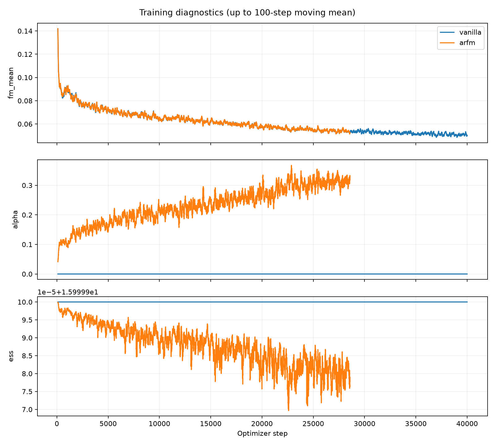
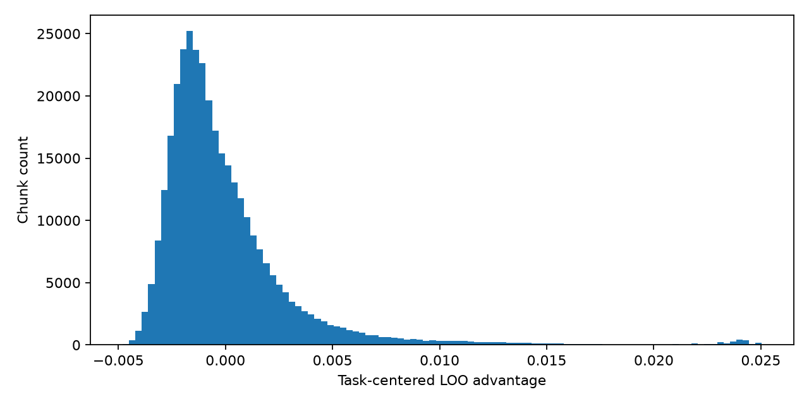

# ARFM independent reproduction results

Only completed evaluations are listed. Empty entries are not paper scores.

| Method | Goal | Spatial | Object | Long | Average |
|---|---:|---:|---:|---:|---:|
| vanilla | 70.40% | 58.80% | 65.60% | 36.40% | 57.80% |
| arfm | pending | pending | pending | pending | pending |
| rwr | pending | pending | pending | pending | pending |

Protocol: Uniform time; seed 42; 50 rollouts/task; last checkpoint; 40 tasks.
RWR fixed alpha=0.1. See ../assumptions.md for reconstruction choices.

